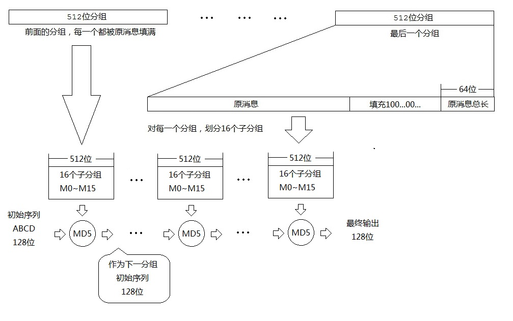

<!-- hash 长度扩展攻击 -->
<!-- 本文主要讲解 MD5 的 hash 长度扩展攻击 -->
# Hash 长度扩展攻击 | 本文主要讲解 MD5 的 hash 长度扩展攻击

https://ctf.mukeran.cn/web/notes/8

前言
====
MD5 是我们常用的一种 hash 算法。但是 MD5 有一个特点：它的结果也是计算的中间过程参数(有些其他 hash 算法也有这个特点)，这样我们就可以利用这个特点(与它的计算过程相结合)。下面是 MD5 算法的计算过程：
  
(图上有一个错误：最后一个分组中第二部分的填充全为 0，没有 1)  
MD5 算法会将原消息分成若干个 512 位长度的分组，最后一个分组内容的前面部分用原消息填充，不足 448 位的部分用 0 填充，最后 64 位以小端规则(简单的来说就是每 8 位从右往左)写入原消息长度 (64 位整数)。  
hash 时，会有一个初始序列 ABCD (ABCD 各有默认值，分别为 0x67452301, 0xefcdab89, 0x98badcfe, 0x10325476)，然后用 ABCD 作为参数，对这个 512 位分组(其中的另外分组与本文研究内容无关)进行非线性运算后得到新的 ABCD，如此对后面的每一个组进行计算，得到最后的 ABCD，按照小端规则(简单的来说就是每 8 位从右往左)，按照 ABCD 的顺序拼接得到 MD5 值。

分析
====
通过上面对 MD5 hash 过程的分析，我们可以知道，我们得到的 MD5 值是整个计算过程中的 ABCD，而且根据 MD5 最后一组公开透明的填充特性，对于下面的情况，我们就可以利用并进行 hash 长度扩展攻击：
> 已知 `key` 的长度，以及 `key` 的 MD5 值

有上面的已知情况，对于可以任意指定的串 `str`，我们可以通过构造 `str`，来知道 `key` 与 `str` 拼接后串的 MD5 值。

利用
====
假设现在有四位长度串 `xxxx`，那么这个串的 16 进制值为 `0xxxxxxxxx`，对其求 MD5 值，那么会被补充为：
```hex
0xxxxxxxxx000000000000000000000000000000000000000000000000000000000000000000000000000000000000000000000000000000002000000000000000
```

(x 表示未知)  
进行 MD5 运算后，得到 MD5 值：`098f6bcd4621d373cade4e832627b4f6`。  
假设现在我们要往这个串后面追加一个值，并且要推算出最后的 MD5 值，那么我们构造这个 `str`：
```hex
0x00000000000000000000000000000000000000000000000000000000000000000000000000000000000000000000000000000000200000000000000041414141
```

最后拼接后的这个串长度为 68，那个会被补充为：
```hex
0xxxxxxxxx00000000000000000000000000000000000000000000000000000000000000000000000000000000000000000000000000000000200000000000000041414141000000000000000000000000000000000000000000000000000000000000000000000000000000000000000000000000000000002200000000000000
```

那么计算过程也会被分成两部分，第一部分正好就为对 `xxxx` 进行 MD5 计算，这时候我们就可以将 MD5 还原为这一步后的 ABCD：0xcd6b8f09, 0x73d32146, 0x834edeca, 0xf6b42726。如果我们能指定 ABCD 对后面一步进行计算，我们就可以得到我们想要的 MD5 值了。后面一步的 MD5 值计算我们可以直接对后面一组：
```hex
41414141000000000000000000000000000000000000000000000000000000000000000000000000000000000000000000000000000000002200000000000000
```

进行一次指定 ABCD 为已知内容 MD5 的 MD5 非线性运算即可。于是我们要利用 MD5 计算的源码，直接网上找一份即可。

一个工具 - Hashpump (但是不好用)
====
有人实现了利用此攻击的工具，但是其实现不是很科学，思想并不是我的文中所讲的那样，后面我会补充解决该问题的通用代码。

题目
====
|名称-来源|类型|WriteUp|
|--------|---|--------|
|[让我进去 - 实验吧](http://www.shiyanbar.com/ctf/1848)|hash 长度扩展攻击|[Web_WriteUp_5](https://ctf.mukeran.cn/web/writeups/5)